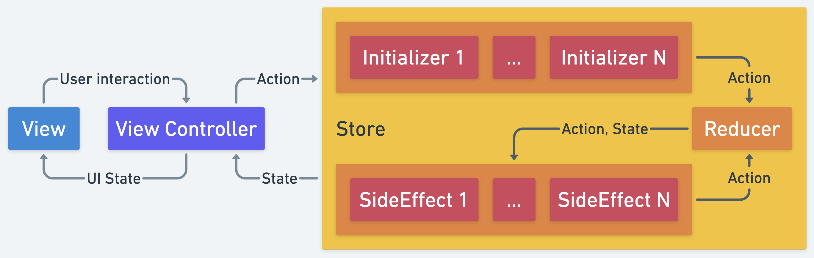

[](https://github.com/g000sha256/reduktor/blob/master/License)
[](https://jitpack.io/#g000sha256/reduktor)
[](https://travis-ci.com/github/g000sha256/reduktor)
[](https://www.codacy.com/gh/g000sha256/reduktor)
[](https://www.codacy.com/gh/g000sha256/reduktor)

# Reduktor (WORK IN PROGRESS)
Библиотека помогает реализовать подход `Unidirectional Data Flow`.
При таком подходе всё представляется в виде потока действий.
Попадая в систему, действие может изменить состояние, породить сайд-эффекты и другие действия.
На выходе системы получаем поток с актуальным состоянием, которое можно отобразить в интерфейсе.
## Описание
Всё взаимодействие происходит через объект `Store`.

У него есть одно публичное поле - `states`.
При подписке на эту цепочку сразу будет отдано актуальное состояние в текущем потоке.
Однако дальнейшие обновления могут приходить в других потоках.
Внутри есть проверка на эквивалентность, поэтому `distinctUntilChanged` можно не использовать.
Эта цепочка никогда не эмитит `onComplete`.

Какие параметры есть у `Store`:
- `state` - начальное состояние.
- `reducer` - сущность, которая преобразовывает новое действие и текущее состояние в новое состояние.
- `initializers` - сущности, которые могут эмитить действия из внешних источников.
Их может быть любое количество (в том числе 0).
- `sideEffects` - сущности, которые преобразовывают новое действие и текущее состояние в поток новых действий.
Их может быть любое количество (в том числе 0).
Могут возвращать пустой поток действий, если новое действие не требуется.
- `logger` - логгер.
Получает сообщения с состоянием системы: какое действие пришло, какое сейчас состояние и какое получилось новое состояние (или что не изменилось).
По умолчанию `null`.
- `scheduler` - шедулер, на котором будет выполняться работа `reducer` и `sideEffects`.
По умолчанию `null` - логика будет работать в том потоке, который сейчас актуален в цепочке.

Принцип работы:
- Действие может попасть в систему через `Initializer`.
Это может быть событие от взаимодействия с пользователем или любое другое внешнее событие (например, новое сообщение из сокета).
- Далее действие проходит через `Reducer`.
Тут действие может повлиять на изменение состояния.
Если состояние изменилось - оно будет отправлено тем, кто на него подписался.
- После этого действие и новое (либо не изменившееся) состояние попадают в `SideEffect`.
- Оттуда возвращаются новые цепочки с действиями.
Подписываемся на них и ожидаем событий.
- Новые действия будут снова отправлены в `Reducer`.




## Wiki
### - [Coroutines](wiki/Coroutines.md)
### - [RxJava](wiki/RxJava.md)


## FAQ
### Варианты использования `Initializer`/`Reducer`/`SideEffect`
#### Класс
```kotlin
class FeatureInitializer : Initializer<FeatureAction, FeatureState> {

    override fun invoke(state: FeatureState): Flowable<FeatureAction> {
        ....
    }

}
```
```kotlin
class FeatureReducer : Reducer<FeatureAction, FeatureState> {

    override fun invoke(action: FeatureAction, state: FeatureState): FeatureState {
        ....
    }

}
```
```kotlin
class FeatureSideEffect : SideEffect<FeatureAction, FeatureState> {

    override fun invoke(action: FeatureAction, state: FeatureState): Flowable<FeatureAction> {
        ....
    }

}
```
#### Метод
```kotlin
fun featureInitializer(state: FeatureState): Flowable<FeatureAction> {
    ....
}
```
```kotlin
fun featureReducer(action: FeatureAction, state: FeatureState): FeatureState {
    ....
}
```
```kotlin
fun featureSideEffect(action: FeatureAction, state: FeatureState): Flowable<FeatureAction> {
    ....
}
```
```kotlin
val initializer = ::featureInitializer
val reducer = ::featureReducer
val sideEffect = ::featureSideEffect
```
#### Лямбда
```kotlin
val initializer = Initializer<FeatureAction, FeatureState> { state -> .... }
```
```kotlin
val reducer = Reducer<FeatureAction, FeatureState> { action, state -> .... }
```
```kotlin
val sideEffect = SideEffect<FeatureAction, FeatureState> { action, state -> .... }
```
#### `DSL`-класс
```kotlin
class FeatureInitializer : DslInitializer<FeatureAction, FeatureState>() {

    override fun Builder.invoke() {
        flat {
            list { state -> .... }
            value { state -> .... }
            ....
        }
        flow { state -> .... }
        ....
    }

}
```
```kotlin
class FeatureReducer : DslReducer<FeatureAction, FeatureState>() {

    override fun Builder.invoke() {
        on<FeatureAction.Action1> { action, state -> .... }
        ....
    }

}
```
```kotlin
class FeatureSideEffect : DslSideEffect<FeatureAction, FeatureState>() {

    override fun Builder.invoke() {
        flat {
            empty<FeatureAction.Action1> { action, state -> .... }
            list<FeatureAction.Action2> { action, state -> .... }
            value<FeatureAction.Action3> { action, state -> .... }
            ....
        }
        flow<FeatureAction.Action4> { action, state -> .... }
        ....
    }

}
```
#### `DSL`-лямбда
```kotlin
val initializer = DslInitializer<FeatureAction, FeatureState> {
    flat {
        list { state -> .... }
        value { state -> .... }
        ....
    }
    flow { state -> .... }
    ....
}
```
```kotlin
val reducer = DslReducer<FeatureAction, FeatureState> {
    on<FeatureAction.Action1> { action, state -> .... }
    ....
}
```
```kotlin
val sideEffect = DslSideEffect<FeatureAction, FeatureState> {
    flat {
        empty<FeatureAction.Action1> { action, state -> .... }
        list<FeatureAction.Action2> { action, state -> .... }
        value<FeatureAction.Action3> { action, state -> .... }
        ....
    }
    flow<FeatureAction.Action4> { action, state -> .... }
    ....
}
```
### Как подписать систему на действия пользователя?
```kotlin
val actions = PublishProcessor.create<FeatureAction>()
val initializer = Initializer<FeatureAction, FeatureState> { actions }
....
actions.onNext(FeatureAction.Click)
```
Или можно использовать `ActionsInitializer`/`ConsumerInitializer`.
### Как подписаться на внешние изменения?
```kotlin
fun featureInitializer(state: FeatureState): Flowable<FeatureAction> {
    return repository
        .getMessages()
        .map { FeatureAction.UpdateMessages(it) }
}
```
### Если не нужно возвращать новое действие в `SideEffect`
В данном случае нужно вернуть `Flowable.empty()`.
```kotlin
fun featureSideEffect(action: FeatureAction, state: FeatureState): Flowable<FeatureAction> {
    when (action) {
        is FeatureAction.Click -> {
            doSomething()
            return Flowable.empty()
        }
        else -> return Flowable.empty()
    }
}
```
### Как отменить вложенную подписку
Для отмены вы можете использовать оператор `takeUntil`.
```kotlin
class FeatureSideEffect : SideEffect<FeatureAction, FeatureState> {

    private val stopProcessor = PublishProcessor.create<FeatureAction>()

    override fun invoke(action: FeatureAction, state: FeatureState): Flowable<FeatureAction> {
        stopProcessor.onNext(action)
        when (action) {
            is FeatureAction.Load -> {
                val stopFlowable = stopProcessor.filter { it is FeatureAction.Load || it is FeatureAction.Stop }
                return load()
                    .takeUntil(stopFlowable) // load() завершится, если придёт FeatureAction.Load или FeatureAction.Stop
            }
            ....
            else -> return Flowable.empty()
        }
    }

}
```
```kotlin
class FeatureSideEffect : DslSideEffect<FeatureAction, FeatureState>() {

    private val stopProcessor = PublishProcessor.create<FeatureAction>()

    override fun Builder.invoke() {
        flat {
            empty<FeatureAction> { action, state -> stopProcessor.onNext(action) }
            ....
        }
        flow<FeatureAction.Load> { action, state ->
            val stopFlowable = stopProcessor.filter { it is FeatureAction.Load || it is FeatureAction.Stop }
            return@flow load()
                .takeUntil(stopFlowable) // load() завершится, если придёт FeatureAction.Load или FeatureAction.Stop
        }
        ....
    }

}
```
### Как избежать зацикливания
Система может зациклится, если вы обработали действие и отправили такое же действие обратно:
```kotlin
fun featureSideEffect(action: FeatureAction, state: FeatureState): Flowable<FeatureAction> {
    when (action) {
        is FeatureAction.Load -> {
            doSomething()
            return Flowable.just(FeatureAction.Load)
        }
        else -> return Flowable.empty()
    }
}
```
### Как избежать неактуального состояния
Нужно помнить, что состояние актуально только в момент вызова.
Если попытаться забрать данные после переключения потока - в системе они могут оказаться уже другими.
```kotlin
fun featureSideEffect(action: FeatureAction, state: FeatureState): Flowable<FeatureAction> {
    when (action) {
        is FeatureAction.Load -> {
            return load(state.id)
                .subscribeOn(ioScheduler)
                .flatMap {
                    // Обращаемся к state за данными после переключения потока.
                    // На момент вызова id может быть уже другим.
                    return@flatMap save(state.id, it)
                        .subscribeOn(ioScheduler)
                }
                .map { FeatureAction.Complete }
        }
        else -> return Flowable.empty()
    }
}
```
Нужно разделить такие блоки и использовать актуальное состояние из следующей итерации:
```kotlin
fun featureSideEffect(action: FeatureAction, state: FeatureState): Flowable<FeatureAction> {
    when (action) {
        is FeatureAction.Load -> {
            return load(state.id)
                .subscribeOn(ioScheduler)
                .map { FeatureAction.Save(it) }
        }
        is FeatureAction.Save -> {
            return save(state.id, action.data)
                .subscribeOn(ioScheduler)
                .map { FeatureAction.Complete }
        }
        else -> return Flowable.empty()
    }
}
```
### Если нужно получить какое-то событие из системы
```kotlin
val actions = PublishProcessor.create<FeatureAction>()
val sideEffect = SideEffect<FeatureAction, FeatureState> { action, state ->
    actions.onNext(action)
    return@SideEffect Flowable.empty()
}
....
actions.subscribe { .... }
```
Или можно использовать `NewsSideEffect`/`NewsSideEffect.*`/`NewsSideEffectWithClass`.
Через него можно фильтровать действия и мапить их в новые объекты.
## Примеры
### Простой пример. Счётчик.
Экран с текстом и двумя кнопками.
В тексте значение 0.
Первая кнопка инкрементит значение, вторая декрементит.
```kotlin
data class FeatureState(val counter: Int = 0)
```
```kotlin
sealed class FeatureAction {

    object Decrement : FeatureAction()

    object Increment : FeatureAction()

}
```
```kotlin
class FeatureReducer : DslReducer<FeatureAction, FeatureState>() {

    override fun Builder.invoke() {
        on<FeatureAction.Decrement> { _, state -> state.copy(counter = state.counter - 1) }
        on<FeatureAction.Increment> { _, state -> state.copy(counter = state.counter + 1) }
    }

}
```
```kotlin
val actions = PublishProcessor.create<FeatureAction>()
....
val initializer = Initializer<FeatureAction, FeatureState> { actions }
val store = Store(
    state = FeatureState(),
    reducer = FeatureReducer(),
    initializers = listOf(initializer)
)
disposable = store
    .states
    .observeOn(mainScheduler)
    .subscribe { state ->
        // обновляем UI
    }
....
// клик по кнопке инкремента
actions.onNext(FeatureAction.Increment)
....
// клик по кнопке декремента
actions.onNext(FeatureAction.Decrement)
....
```
### Пример посложнее. Список пользователей.
Необходимо загрузить и показать список пользователей (без пагинации).
Во время загрузки отображаем лоадер.
Если произошла ошибка - можно перезапустить загрузку кликом по кнопке повтора.
При клике на пользователя - открываем ссылку в браузере.
```kotlin
data class FeatureState(
    val isLoading: Boolean = false,
    val users: List<User>? = null,
    val throwable: Throwable? = null
)
```
```kotlin
sealed class FeatureAction {

    class Click(val position: Int) : FeatureAction()

    object Init : FeatureAction()

    object Load : FeatureAction()

    object Retry : FeatureAction()

    sealed class Data : FeatureAction() {

        class Error(val throwable: Throwable) : Data()

        class Loaded(val users: List<User>) : Data()

        object Loading : Data()

    }

}
```
```kotlin
class FeatureReducer : DslReducer<FeatureAction, FeatureState>() {

    override fun Builder.invoke() {
        on<FeatureAction.Data.Error> { action, state -> state.copy(isLoading = false, throwable = action.throwable) }
        on<FeatureAction.Data.Loaded> { action, state -> state.copy(isLoading = false, users = action.users) }
        on<FeatureAction.Data.Loading> { _, state -> state.copy(isLoading = true, throwable = null) }
    }

}
```
```kotlin
class FeatureSideEffect(
    private val repository: FeatureRepository,
    private val router: FeatureRouter
) : DslSideEffect<FeatureAction, FeatureState>() {

    override fun Builder.invoke() {
        flat {
            empty<FeatureAction.Click> { action, state ->
                val users = state.users ?: return@empty
                val user = users.getOrNull(action.position) ?: return@empty
                router.openBrowser(user.url)
            }
            value<FeatureAction.Init> { _, _ -> FeatureAction.Load }
            value<FeatureAction.Retry> { _, _ -> FeatureAction.Load }
        }
        flow<FeatureAction.Load> { _, state ->
            if (state.isLoading) return@flow Flowable.empty()
            if (state.users != null) return@flow Flowable.empty()
            return@flow repository
                .getUsers()
                .toFlowable()
                .map<FeatureAction> { users -> FeatureAction.Data.Loaded(users) }
                .onErrorReturn { throwable -> FeatureAction.Data.Error(throwable) }
                .startWith(FeatureAction.Data.Loading)
        }
    }

}
```
```kotlin
....
val actions = PublishProcessor.create<FeatureAction>()
....
val initializer = Initializer<FeatureAction, FeatureState> { actions }
val sideEffect = FeatureSideEffect<FeatureAction, FeatureState>(repository, router)
val store = Store(
    state = FeatureState(),
    reducer = FeatureReducer(),
    initializers = listOf(initializer),
    sideEffects = listOf(sideEffect)
)
disposable = store
    .states
    .observeOn(mainScheduler)
    .subscribe { state ->
        // обновляем UI
    }
....
// инициализация
actions.accept(FeatureAction.Init)
....
// клик по элементу списка
val action = FeatureAction.Click(position)
actions.accept(action)
....
// клик по кнопке повтора загрузки
actions.accept(FeatureAction.Retry)
....
```